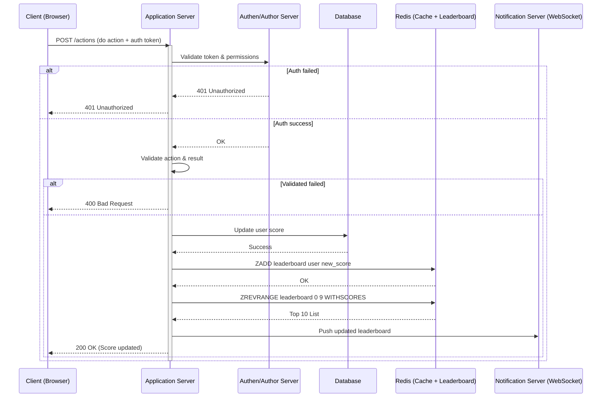

# Problem 6 – Scoreboard Module Architecture

## 1. Overview

This module implements a real-time scoreboard system for a web/app platform. It supports:

- Displaying the **top 10 users with the highest scores** (leaderboard).
- **Live updates** to subscribed clients when the leaderboard changes.
- **Secure score updates** based on valid in-game actions.
- **Anti-cheat** mechanisms to prevent unauthorized score increases.

---

## 2. API Design

### a. Get Leaderboard

- **GET** `/api/leaderboard`
- **Response:**
  ```json
  [
    { "userId": "alice", "score": 2031 },
    { "userId": "bob", "score": 1985 }
  ]
  ```

### b. Update Score

- **POST** `/api/update-score`
- **Request:**
  ```json
  {
    "userId": "abc1",
    "actionId": "game_mission_1",
    "jwt": "<user_jwt_token>"
  }
  ```
- **Response:**
  ```json
  { "success": true, "newScore": 124 }
  ```
- **Note:** `actionId` must be unique per user to ensure **idempotency** and prevent replay attacks.

### c. Live Leaderboard Updates

- **WebSocket/SSE**: Clients subscribe to receive real-time updates when the top 10 changes.

---

## 3. Execution Flow



---

## 4. Redis Leaderboard Design

The system uses **Redis Sorted Set (ZSET)** for fast, in-memory leaderboard management.

### Commands:

| Action                       | Command Example                        |
| ---------------------------- | -------------------------------------- |
| Add/Increase user score      | `ZINCRBY leaderboard 10 user123`       |
| Get top 10 users             | `ZREVRANGE leaderboard 0 9 WITHSCORES` |
| Remove user from leaderboard | `ZREM leaderboard user123`             |

### Benefits:

- Fast: All operations are **O(logN)**
- Realtime: Perfect for live top-10 ranking
- Simple: Easily resettable or backfilled from DB

---

## 5. Security & Anti-Cheat Measures

| Risk               | Mitigation Strategy                                              |
| ------------------ | ---------------------------------------------------------------- |
| Fake score update  | Require valid **JWT** for all write actions                      |
| Replay attack      | Enforce **unique `actionId` per user** (store/check in DB/Redis) |
| Spamming updates   | Use **rate limiting** per user (e.g., Redis + sliding window)    |
| Score tampering    | Never trust client-side score; only backend calculates score     |
| Debug/trace issues | Log all updates in **audit table** for rollback & investigation  |

---

## 6. Scaling & Reliability Enhancements

- **Stateless service**: All backend services are stateless → scale horizontally via load balancer.
- **Pub/Sub sync**: Use Redis Pub/Sub or Kafka to sync leaderboard/cache across ScoreService replicas.
- **Fallback logic**:
  - If Redis unavailable → rebuild leaderboard from DB on demand.
  - Temporary **in-memory fallback** (e.g., LRU cache) for short outages.
- **Efficient notifications**:
  - Only push updates if leaderboard actually changed (compare hashes before broadcasting).
- **Monitoring**:
  - Integrate with Prometheus + Grafana for suspicious activity (e.g., rapid scoring).
- **Score history**:
  - Maintain time-series score log per user (optional) for analytics or rollback.

---

## 7. Suggested Tech Stack

| Component            | Technology                        |
| -------------------- | --------------------------------- |
| API Gateway          | Nginx + JWT Middleware            |
| Auth Service         | Node.js / Go + JWT                |
| Score Service        | Node.js / Go                      |
| ScoreProcessor       | Internal logic handler            |
| Database             | PostgreSQL (user, score, actions) |
| Cache & Leaderboard  | Redis (ZSET)                      |
| Notification Service | WebSocket + Redis Pub/Sub         |
| Monitoring           | Prometheus + Grafana              |

---

## 8. Conclusion

This design balances **performance**, **security**, and **scalability**, making it suitable for real-time applications such as games or competitive learning apps. The system leverages Redis and WebSocket for high-speed interactions, while remaining resilient via stateless design, rate limiting, and strong data validation.
