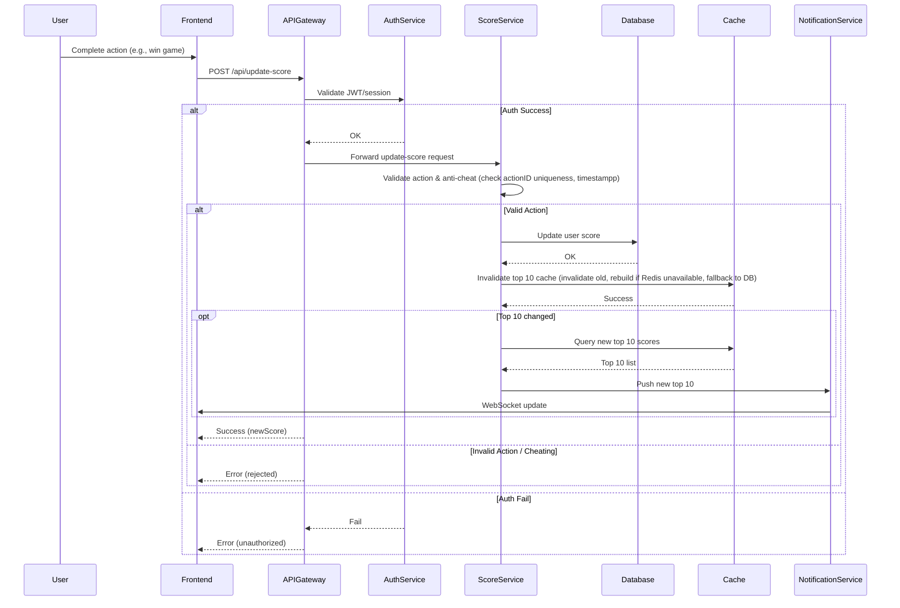

# Problem 6 – Scoreboard Module Architecture

## 1. Overview

This module implements a live scoreboard for a web/app, supporting:
- Displaying the top 10 users with the highest scores (leaderboard).
- Real-time updates to the leaderboard when user scores change.
- Securely updating user scores only after a valid action.
- Anti-cheat measures to prevent unauthorized score increases.

---

## 2. API Design

### a. Get Leaderboard
- **GET** `/api/leaderboard`
- **Response:**
    ```json
    [
      { "userId": "alice", "score": 2031 },
      { "userId": "bob", "score": 1985 },
      { "userId": "charlie", "score": 1872 },
      { "userId": "daisy", "score": 1720 },
      { "userId": "emily", "score": 1693 },
      { "userId": "frank", "score": 1630 },
      { "userId": "grace", "score": 1602 },
      { "userId": "harry", "score": 1527 },
      { "userId": "isabel", "score": 1476 },
      { "userId": "john", "score": 1405 }
    ]
    ```

### b. Update Score
- **POST** `/api/update-score`
- **Request:**
    ```json
    {
      "userId": "abc1",
      "actionId": "game_mission_1",
      "jwt": "<user_jwt_token>"
    }
    ```
- **Response:**
    ```json
    { "success": true, "newScore": 124 }
    ```

### c. Live Leaderboard Updates (WebSocket/SSE)
- When the top 10 changes, the backend pushes updates to subscribed clients.

---

## 3. Execution Flow (Sequence Diagram with Conditions)


## 4. Redis Leaderboard Solution

The system leverages **Redis Sorted Set (ZSET)** for fast leaderboard operations.

**Main commands:**

- **Increase user score:**
    ```redis
    ZINCRBY leaderboard 10 user123
    ```
  Increments the score of user `user123` by 10.
- **Fetch top 10 users:**
    ```redis
    ZREVRANGE leaderboard 0 9 WITHSCORES
    ```
  Retrieves the top 10 users with the highest scores.
- **Remove user from leaderboard:**
    ```redis
    ZREM leaderboard user123
    ```

**Advantages:**
- **Fast:** All leaderboard read/write operations are O(logN).
- **Scalable:** Suitable for real-time systems with frequent score changes.
- **Simple backup:** Snapshot leaderboard to persistent storage as needed.

---

## 5. Security & Anti-Cheat Considerations

- **Authentication:** Require a valid JWT/OAuth token for any score update.
- **Validation:** The backend verifies that each action is legitimate, not a replay or spam (e.g., each `actionId` is unique for each user).
- **Rate limiting:** Apply API rate limits per user to prevent abuse.
- **Audit log:** Record all score updates for security monitoring and troubleshooting.
- **Never trust the client:** All validation and score calculations happen on the backend only.

---

## 6. Potential Improvements

- **Horizontal scaling:**  
  The ScoreService is stateless, so it can be deployed behind a load balancer and auto-scaled.
- **Pub/Sub:**  
  Use Redis Pub/Sub or Kafka to sync leaderboard or cache updates across multiple ScoreService instances.
- **Efficient notifications:**  
  Only send real-time leaderboard updates to clients when the actual top 10 changes.
- **Monitoring and alerting:**  
  Track suspicious activity (unusually fast score increases, bot patterns, etc.) and trigger alerts.
- **Score history:**  
  Store historical score changes for analytics, rollback, and leaderboard trends.
